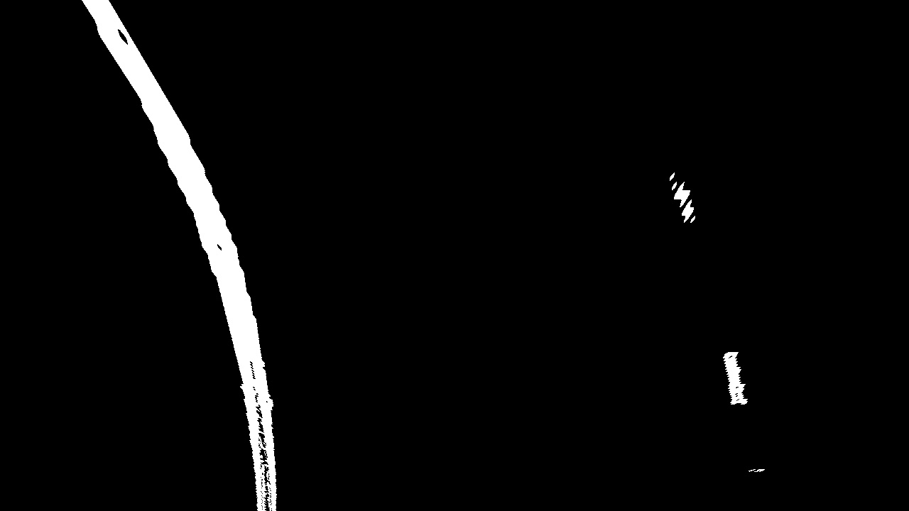

# **Advanced Lane Finding**

[Exported Jupyter notebook](https://jefflirion.github.io/udacity_car_nanodegree_project04/Advanced_Lane_Finding_Project.html)

---

## From Udacity:

> The goals / steps of this project are the following:
>
> * Compute the camera calibration matrix and distortion coefficients given a set of chessboard images.
> * Apply a distortion correction to raw images.
> * Use color transforms, gradients, etc., to create a thresholded binary image.
> * Apply a perspective transform to rectify binary image ("birds-eye view").
> * Detect lane pixels and fit to find the lane boundary.
> * Determine the curvature of the lane and vehicle position with respect to center.
> * Warp the detected lane boundaries back onto the original image.
> * Output visual display of the lane boundaries and numerical estimation of lane curvature and vehicle position.
>
>
>
> ## Rubric Points
>
> Here I will consider the [rubric points](https://review.udacity.com/#!/rubrics/571/view) individually and describe how I addressed each point in my implementation.  


### Writeup / README

#### 1. Provide a Writeup / README that includes all the rubric points and how you addressed each one.  You can submit your writeup as markdown or pdf.  [Here](https://github.com/udacity/CarND-Advanced-Lane-Lines/blob/master/writeup_template.md) is a template writeup for this project you can use as a guide and a starting point.  

You're reading it!

### Camera Calibration

#### 1. Briefly state how you computed the camera matrix and distortion coefficients. Provide an example of a distortion corrected calibration image.

The code for this step can be found here: [1. Compute the camera calibration matrix and distortion coefficients given a set of chessboard images.](./Advanced_Lane_Finding_Project.html#1.-Compute-the-camera-calibration-matrix-and-distortion-coefficients-given-a-set-of-chessboard-images.) and [`image.calibrate_camera()`](./image.html#image.calibrate_camera)

I loaded the calibration images and converted them to grayscale.  I specified that there are 9 interior corners in the x direction (`nx = 9`) and 6 interior corners in the y direction (`ny = 6`) in these calibration images.  I used the function `cv2.findChessboardCorners()` to find these points in the images, and when they were successfully found I appended the checkerboard indices to the array `objpoints` and appended their corresponding pixel coordinates to the array `imgpoints`.  I used `cv2.calibrateCamera()` to compute the calibration and distortion coefficients.  

Here is the original "calibration8.jpg":


And here is the undistorted image:


### Pipeline (single images)

#### 1. Provide an example of a distortion-corrected image.

Here is the original "straight_lines1.jpg":


And here is the undistorted image:


#### 2. Describe how (and identify where in your code) you used color transforms, gradients or other methods to create a thresholded binary image.  Provide an example of a binary image result.

See [`Lane.get_binary()`](./lane.html#Lane.get_binary())

I used a combination of color and gradient thresholds to generate a binary image.  More specifically, I thresholded the gradient of the L channel and the pixel values of the S channel.  Here's an example of my output for this step:


#### 3. Describe how (and identify where in your code) you performed a perspective transform and provide an example of a transformed image.

See [`Lane.get_perspective()`](./lane.html#Lane.get_perspective()) and [Perspective transform constants](./Advanced_Lane_Finding_Project.html#Perspective-transform-constants)

For my perspective transform, I specified 4 corners of a trapezoid (as `src`) in the undistorted original images and I specified the 4 corresponding corners of a rectangle (as `dst`) to which they are mapped in the perspective image.  After inspecting an undistorted image, I specified the parameters as follows:

```python
offset_x = 300
offset_y = 0

src = np.float32([[595, 450], [685, 450], [1000, 660], [280, 660]])

dst = np.float32([[offset_x, offset_y],
                  [img_size[0]-offset_x, offset_y],
                  [img_size[0]-offset_x, img_size[1]-offset_y],
                  [offset_x, img_size[1]-offset_y]])
```

Here is the undistorted "straight_lines1.jpg":


And here is a perspective view of the same image (with lines drawn):


#### 4. Describe how (and identify where in your code) you identified lane-line pixels and fit their positions with a polynomial?

See [`Lane.fit_lines()`](./lane.html#Lane.fit_lines())

Here are the steps I followed for fitting the lane lines.  

1. Get the thresholded binary image and apply the perspective transform.  See [`Lane.get_binary_perspective()`](./lane.html#Lane.get_binary_perspective())

  

2. Find the sets of points to which I'll fit a polynomial in order to get the left and right lane lines.  If there was a prior image (i.e., `Lane` object), then I used the points within +/- `margin_prior` of the previous fitted line; otherwise, I used a sliding window search (see [`Lane.find_window_centroids()`](./lane.html#Lane.find_window_centroids()).  Here is an example plot of the points used to fit the lane lines (in red and blue) found via `Lane.find_window_centroids()`:

  

3. Fit polynomials to the sets of points found in the previous step.  My code accepts a parameter `d` that specifies the degree of the polynomials, but I only experimented with `d = 2`.  I fitted polynomials for both pixels and meters as the measurement units.  In the next step, I did some post-processing on these polynomials.  

4. Post-process the fitted polynomials.  If the image (i.e., `Lane` object) was part of a sequence, I averaged the polynomial coefficients over the last `n=3` polynomial fits.  I then computed the root mean square error (RMSE; see [`Lane.rmse()`](./lane.html#Lane.rmse())) for both the left and right polynomials, where only points within +/- `margin` of the polynomials were considered.  The polynomial with the lower RMSE *should* be a better fit to the true lane line.  I discarded the polynomial with the higher RMSE and replaced it with a polynomial of degree 2 such that:

  * it has the same `x` value as the discarded polynomial at `y = rows - 1`, where `rows` is the number of rows in the image
  * it has the same first derivative as the polynomial with the lower RMSE at `y = rows - 1`
  * its radius of curvature at `y = rows - 1` is greater/smaller than the other polynomial's radius of curvature by `abs(x_right[rows-1] - x_left[rows-1])`, depending on which direction the car is turning.

  Here is an example of the final fitted lane lines, which I generated using [`Lane.plot_lines_perspective()`](./lane.html#Lane.plot_lines_perspective()):

  


#### 5. Describe how (and identify where in your code) you calculated the radius of curvature of the lane and the position of the vehicle with respect to center.

See [`Lane.get_rad_curv()`](./lane.html#Lane.get_rad_curv()) and [`Lane.get_offset()`](./lane.html#Lane.get_offset())

I calculated the left and right radii of curvature using the formula:

```
r = (1 + (first_deriv)**2)**1.5 / abs(second_deriv)
```

I calculated the offset of the vehicle by finding the `x` values (in meters) of the left and right polynomials at `y = (rows - 1) * ym_per_pix` and then took the difference from the center column of the image, converted to meters: `center = cols / 2 * xm_per_pix`.  


#### 6. Provide an example image of your result plotted back down onto the road such that the lane area is identified clearly.

See [`Lane.plot_lines()`](./lane.html#Lane.plot_lines())

Here is an example of the lane lines plotted on the undistorted road image for "test2.jpg":


---

### Pipeline (video)

#### 1. Provide a link to your final video output.  Your pipeline should perform reasonably well on the entire project video (wobbly lines are ok but no catastrophic failures that would cause the car to drive off the road!).

Here's a [link to my video result](./project_video_lanes.mp4)

---

### Discussion

#### 1. Briefly discuss any problems / issues you faced in your implementation of this project.  Where will your pipeline likely fail?  What could you do to make it more robust?

**Challenges**

Getting good quality binary images was more difficult than I expected, and I feel that there is a lot of room for improvement on this aspect of the project.  The difficulty was detecting the lanes but not detecting other edges, such as those due to shadows or the edge of the road.  

**Where the pipeline struggles**

As can be seen in the [video](./project_video_lanes.mp4), this pipeline struggles when the car bounces and when the slope of the road changes.  This is because the hard-coded perspective transform parameters are no longer correct.  A better approach might involve finding the vanishing point of the images; that is, the point to which all straight lines converge.  

**Where the pipeline might fail**

I can think of three general categories that would cause this pipeline to fail:

1. **The car is not driving within the lane lines.**  This pipeline assumes that the car is driving more or less in the center of the lane.  It would likely fail if the car were to change lanes because the model is simply not designed to handle a complex case such as this.  
2. **The binary thresholding portion of the pipeline does not detect the lane lines.**  As I mentioned before, I feel that this aspect of the pipeline could be made much more accurate and robust.  
3. **The binary thresholding portion of the pipeline fails to eliminate edges which are not lane lines.**  While I did not work much with the challenge video, the pipeline performs poorly there due to the line in the middle of the lane between the light and dark asphalt.  The model might also struggle with "tar snakes" on a road.  In order to accurately fit a polynomial to the lane lines, we need to have good data points with minimal noisy data points.  

Issues 2 and 3 relate to finding which pixels correspond to the lanes.  If we can do this reliably, then fitting a polynomial to those points should yield accurate estimations of the lane lines.  
